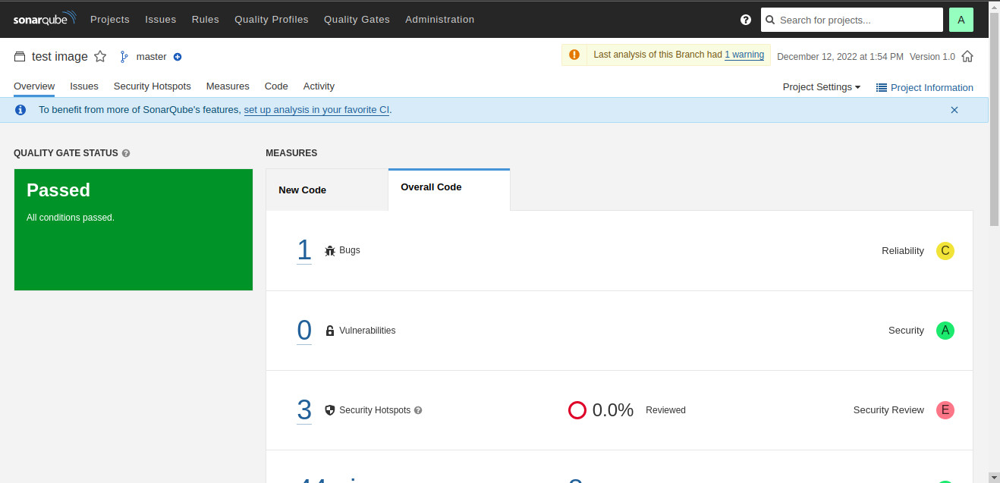

# Sonarqube

# Table of contents
1. [Introduction](#what-is-sonarqube)
2. [Requirement](#requirement)
3. [Usage](#usage)

## Introduction
[**Sonarqube**](https://www.sonarqube.org/)  is the leading tool for continuously inspecting the Code Quality and Security of your codebases, and guiding development teams during Code Reviews. 

## Requirement
- Installing [**Docker**](https://www.docker.com/)

## Usage

1. Installing SonarQube locally on Linux by entering the following commands in to terminals:

    1. Pull Sonarqube image 
    ```
    docker pull sonarqube
    ```

    2. Start the server by running:
    ```
    docker run -d --name sonarqube -e SONAR_ES_BOOTSTRAP_CHECKS_DISABLE=true -p 9000:9000 sonarqube:latest
    ```

    >Please waiting a few minutes, Log in to http://localhost:9000 using System Administrator credentials:
    >- login: admin
    >- password: admin

    </br>

2. Analyzing source code with Docker

    Now that you're logged in to your local SonarQube instance, let's analyze a project:
    
    1. Click the **Projects** -> **Create Project** -> **Manual button**.
    2. Give your project a **Project key** and a **Display name** and click the **Set Up** button.
    3. Under Provide a token, select **Generate a token**. Give your token a name, click the **Generate** button, and click **Continue**. Write down your generated token, it will be used for login, example:
        >d32ede54513ec7b92589139aaaa5781c121a9303.

    4. Create a configuration file in your project's root directory called **sonar-project.properties**:
        ```
        # must be unique in a given SonarQube instance
        sonar.projectKey={myproject}

        # --- optional properties ---

        # defaults to project key
        sonar.projectName={My project}
        # defaults to 'not provided'
        sonar.projectVersion=1.0

        # Path is relative to the sonar-project.properties file. Defaults to .
        sonar.sources=.

        # Encoding of the source code. Default is default system encoding
        sonar.sourceEncoding=UTF-8
        ```

    5. Running sonarqube server:
        ```
        docker run --rm --link sonarqube \
        -e SONAR_HOST_URL="http://sonarqube:9000" \
        -e SONAR_LOGIN="${TOKEN}" \
        -v "${YOUR_REPO}:/usr/src" \
        sonarsource/sonar-scanner-cli
        ```

        >Replace the variable ${YOUR_REPO} with the full path of the project's root directory (e.g., /home/user/myproject).
    
        
